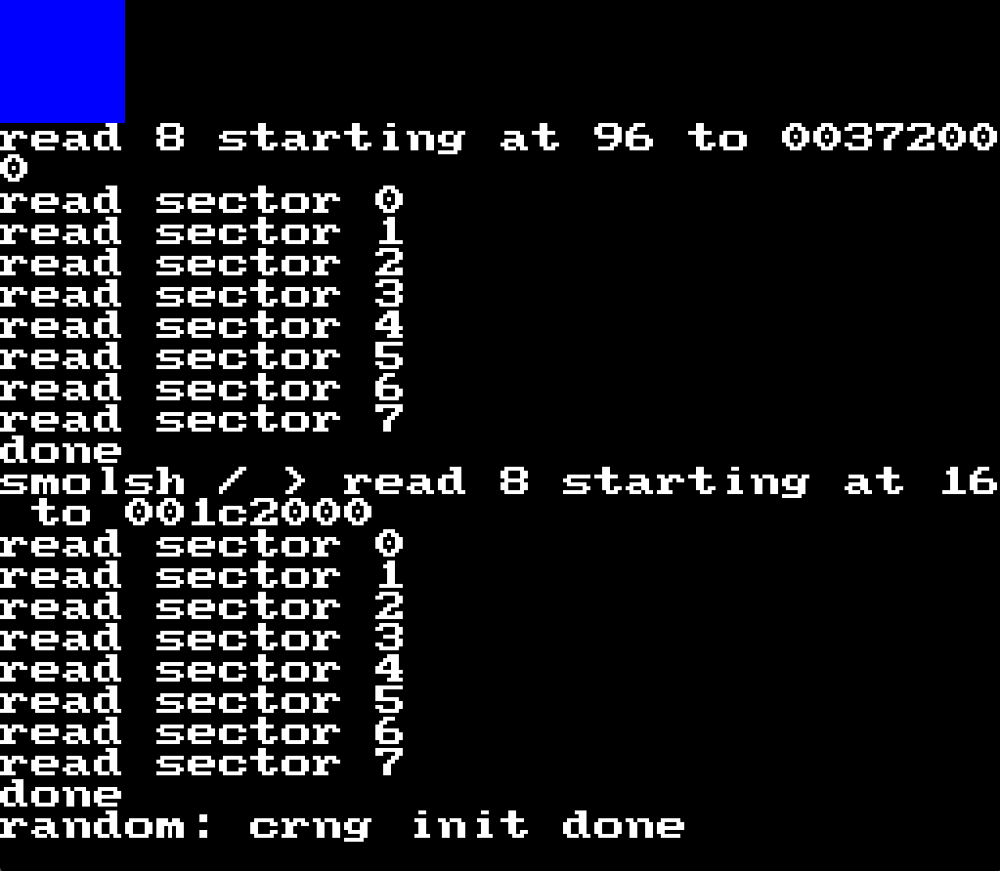

# linuxmd
Linux for the Sega MegaDrive

## Is this a joke?

No

## What do I need?

- A Sega Megadrive
- Mega EverDrive Core or Pro (pro is untested) (See: https://krikzz.com/our-products/cartridges/)
- USB cable between the EverDrive and your PC
- Time to burn

## Will this work on a (normal) emulator?

Probably not, the emulator would need to emulate the EverDrive's special `SSF2` mapper that gives
us 4MB of RAM, the EverDrive's protocol that allows the MegaDrive to load files from the SD
card and the timer register the EverDrive provides.

A QEMU fork that emulates enough of the MegaDrive and the EverDrive to play with this without
the real hardware is included. Note that this doesn't really emulate the feel of the real thing,
QEMU emulates the CPU way too fast.

## Build instructions

- Run `./buildtoolchain.sh` to build a toolchain. This uses buildroot but we do not build a root
  filesystem with it. buildroot is the least painful way to get a m68k-linux toolchain that can
  produce usable binaries for 68000.

- Run `./builduboot.sh` to use the toolchain to build u-boot.

- Run `./buildmedtool.sh` to build `medtool` to interact with the everdrive for serial console.

- Run `./buildlinux.sh` to build the linux kernel image.

- Run `./buildrootfs.sh` to build the rootfs erofs image.

TODO

## Boot instructions

- Copy `u-boot/u-boot.bin`, `linux/vmlinux.lz4`, `smolutils/m68k.erofs` to your EverDrive SD card

- Power up the Megadrive

- Connect the USB cable to your PC (It might be OK to connect it while the Megadrive is off but I had issues with it)

- Check your dmesg to make sure the EverDrive is detected. You should see something like this:

```
[1135618.045606] usb 3-2: new full-speed USB device number 5 using xhci_hcd
[1135618.255415] usb 3-2: New USB device found, idVendor=0483, idProduct=5740, bcdDevice= 2.00
[1135618.255428] usb 3-2: New USB device strings: Mfr=1, Product=2, SerialNumber=3
[1135618.255430] usb 3-2: Product: Mega EverDrive
[1135618.255432] usb 3-2: Manufacturer: STMicroelectronics
[1135618.255434] usb 3-2: SerialNumber: 00000000001A
[1135618.307393] cdc_acm 3-2:1.0: ttyACM0: USB ACM device
[1135618.307472] usbcore: registered new interface driver cdc_acm
[1135618.307475] cdc_acm: USB Abstract Control Model driver for USB modems and ISDN adapters
```

- Connect `medtool` to your EverDrive in `terminal` mode:

```
./medtool/medtool -p /dev/ttyACM0 -m terminal
Opened serial port /dev/ttyACM0
data out, 4 bytes -->
0x2b 0xd4 0x40 0xbf 
<-- data in, 4 bytes
0x5a 0x05 0x25 0x00 
core
Creating socket and waiting for connection (minicom -D unix#/tmp/medtool)
```

- Do what it told you and start `minicom` with it connecting to the unix socket for `medtool`

- In the EverDrive menu select `u-boot.bin` hit a button, and then hit `start game`


- Wait a little while and you should see u-boot appear on in minicom:

```
Welcome to minicom 2.10

OPTIONS: I18n 
Port unix#/tmp/medtool [?]

Press CTRL-A Z for help on special keys

md
!
a
b
c


U-Boot 2026.01-00673-g32ab0871de57 (Jun 18 2026 - 18:11:22 +0900)

DRAM:  3.8 MiB
SR is 0x2700
copy from 00000000 to 00398000, 0x27f70 bytes (reloc_off 0x00398000)
copied from 00000000 to 00398000, 0x27f70 bytes (reloc_off 0x00398000)
clearing new bss from 003bd000 to 003bff70
Doing relocation 
Relocation point of no return, new SP 0x003368d0, jump to 0x003a0370
Core:  5 devices, 5 uclasses, devicetree: embed
Loading Environment from NVRAM... *** Warning - bad CRC, using default environment

In:    serial
Out:   serial,vidconsole
Err:   serial
Hit any key to stop autoboot: 0
status; 0xa500
status; 0xa500
Loading vmlinux.lz4, 738513 bytes
status; 0xa500
Done
Uncompressed size: 1266268 = 0x13525C
ELF overwrites reserved memory: 0x00000000 -> 0x000f7b10: -22
new fdt 00339248
L
s
KLinux version 7.1.0-rc6-00209-gfdd510718e7e (daniel@kinako) (m68k-linux-gcc.br_real (Buildroot -gdb75a8eea0bd) 15.2.0, GNU ld (GNU Binutils) 2.46.0.20260210) #172 Thu Jun 18 18:10:11 JST 2026
printk: legacy bootconsole [debug0] enabled
Flat model support (C) 1998,1999 Kenneth Albanowski, D. Jeff Dionne
Generic DT Machine (C) 2024 Daniel Palmer <daniel@thingy.jp>
OF: reserved mem: Reserved memory: No reserved-memory node in the DT
Zone ranges:
  DMA      [mem 0x0000000000000000-0x00000000003fffff]
  Normal   empty
Movable zone start for each node
Early memory node ranges
  node   0: [mem 0x0000000000000000-0x00000000003fffff]
Initmem setup node 0 [mem 0x0000000000000000-0x00000000003fffff]
Kernel command line: earlyprintk console=ttyVDP0 console=ttyED0 root=/dev/edblk -- smolinit.getty=/dev/ttyED0 smolinit.hostname=md
Unknown kernel command line parameters "earlyprintk", will be passed to user space.
printk: log buffer data + meta data: 4096 + 8704 = 12800 bytes
Dentry cache hash table entries: 1024 (order: 0, 4096 bytes, linear)
Inode-cache hash table entries: 1024 (order: 0, 4096 bytes, linear)
Built 1 zonelists, mobility grouping off.  Total pages: 1024
mem auto-init: stack:off, heap alloc:off, heap free:off
SLUB: HWalign=16, Order=0-1, MinObjects=0, CPUs=1, Nodes=1
NR_IRQS: 32
Calibrating delay loop... 1.20 BogoMIPS (lpj=6016)
pid_max: default: 4096 minimum: 301
Mount-cache hash table entries: 1024 (order: 0, 4096 bytes, linear)
Mountpoint-cache hash table entries: 1024 (order: 0, 4096 bytes, linear)
VFS: Finished mounting rootfs on nullfs
Memory: 2532K/4096K available (989K kernel code, 63K rwdata, 108K rodata, 72K init, 28K bss, 1356K reserved, 0K cma-reserved)
devtmpfs: initialized
clocksource: jiffies: mask: 0xffffffff max_cycles: 0xffffffff, max_idle_ns: 19112604462750000 ns
workingset: timestamp_bits=30 (anon: 26) max_order=10 bucket_order=0 (anon: 0)
printk: legacy console [ttyVDP0] enabled
printk: legacy console [ttyED0] enabled
printk: legacy console [ttyED0] enabled
printk: legacy bootconsole [debug0] disabled
printk: legacy bootconsole [debug0] disabled
everdrive-blk everdrive-blk@0: Everdrive blk created for m68k.erofs, size is 90112
erofs (device edblk): mounted with root inode @ nid 36.
VFS: Mounted root (erofs filesystem) readonly on device 259:0.
devtmpfs: mounted
VFS: Pivoted into new rootfs
Freeing unused kernel image (initmem) memory: 72K
This architecture does not have kernel memory protection.
Run /sbin/init as init process
....
```

Loading and decompressing the kernel will take some time. Wait!
At the moment on the real hardware something gets stuck in a loop somewhere and getting booted can (will) take a long time.

## But what's the point if its just over serial anyone can do that?



Prize for someone that can workout a nice 32x32 16 colour tux or logo to go where the blue box is.
