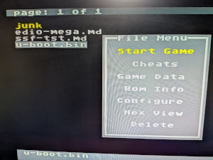

# linuxmd
Linux for the Sega MegaDrive

## Is this a joke?

No

## What do I need?

- A Sega Megadrive
- Mega EverDrive Core or Pro (pro is untested) (See: https://krikzz.com/our-products/cartridges/)
- USB cable between the EverDrive and your PC
- Time to burn

## Will this work on an emulator?

Probably not, the emulator would need to emulate the EverDrive's special `SSF2` mapper that gives
use 4MB of RAM and the EverDrive's protocol that allows the MegaDrive to load files from the SD
card.

## Build instructions

- Run `./buildtoolchain.sh` to build a toolchain. This uses buildroot but we do not build a root
  filesystem with it. buildroot is the least painful way to get a m68k-linux toolchain that can
  produce usable binaries for 68000.

- Run `./builduboot.sh` to use the toolchain to build u-boot.

- Run `./buildmedtool.sh` to build `medtool` to interact with the everdrive for serial console.

- Run `./buildlinux.sh` to build the linux kernel image. (NOTE: at the moment this does not produce a workable image).

- Run `./buildrootfs.sh` to build the rootfs erofs image.

TODO

## Boot instructions

- Copy `u-boot/u-boot.bin`, `linux/vmlinux.lz4`, `smolutils/m68k.erofs` to your EverDrive SD card

- Power up the Megadrive

- Connect the USB cable to your PC (It might be OK to connect it while the Megadrive is off but I had issues with it)

- Check your dmesg to make sure the EverDrive is detected. You should see something like this:

```
[1135618.045606] usb 3-2: new full-speed USB device number 5 using xhci_hcd
[1135618.255415] usb 3-2: New USB device found, idVendor=0483, idProduct=5740, bcdDevice= 2.00
[1135618.255428] usb 3-2: New USB device strings: Mfr=1, Product=2, SerialNumber=3
[1135618.255430] usb 3-2: Product: Mega EverDrive
[1135618.255432] usb 3-2: Manufacturer: STMicroelectronics
[1135618.255434] usb 3-2: SerialNumber: 00000000001A
[1135618.307393] cdc_acm 3-2:1.0: ttyACM0: USB ACM device
[1135618.307472] usbcore: registered new interface driver cdc_acm
[1135618.307475] cdc_acm: USB Abstract Control Model driver for USB modems and ISDN adapters
```

- Connect `medtool` to your EverDrive in `terminal` mode:

```
./medtool/medtool -p /dev/ttyACM0 -m terminal
Opened serial port /dev/ttyACM0
data out, 4 bytes -->
0x2b 0xd4 0x40 0xbf 
<-- data in, 4 bytes
0x5a 0x05 0x25 0x00 
core
Creating socket and waiting for connection (minicom -D unix#/tmp/medtool)
```

- Do what it told you and start `minicom` with it connecting to the unix socket for `medtool`

- In the EverDrive menu select `u-boot.bin` hit a button, and then hit `start game`



- Wait a little while and you should see u-boot appear on in minicom:

```
Welcome to minicom 2.10

OPTIONS: I18n 
Port unix#/tmp/medtool [?]

Press CTRL-A Z for help on special keys

md
!
a
b
c


U-Boot 2026.01-00647-g39f62d87171b-dirty (Feb 14 2026 - 16:46:36 +0900)

DRAM:  3 MiB
SR is 0x2710
copy from 00000000 to 002d9000, 0x265d0 bytes (reloc_off 0x002d9000)
copied from 00000000 to 002d9000, 0x265d0 bytes (reloc_off 0x002d9000)
clearing new bss from 002fd000 to 002ff5d0
Doing relocation 
Relocation point of no return, new SP 0x00197a30, jump to 0x002e1b1a
Core:  4 devices, 4 uclasses, devicetree: embed
Loading Environment from NVRAM... *** Warning - bad CRC, using default environment

In:    serial
Out:   serial,vidconsole
Err:   serial
=> 
``` 

TODO
